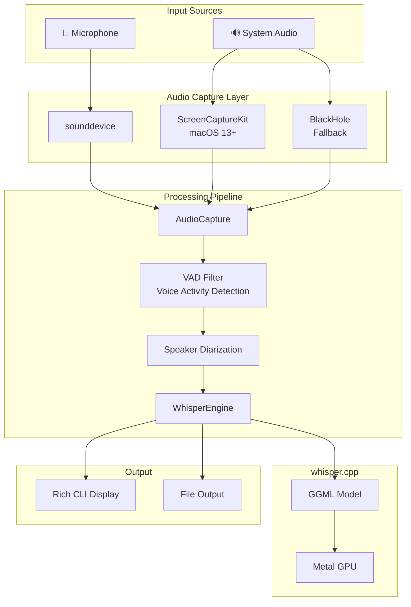
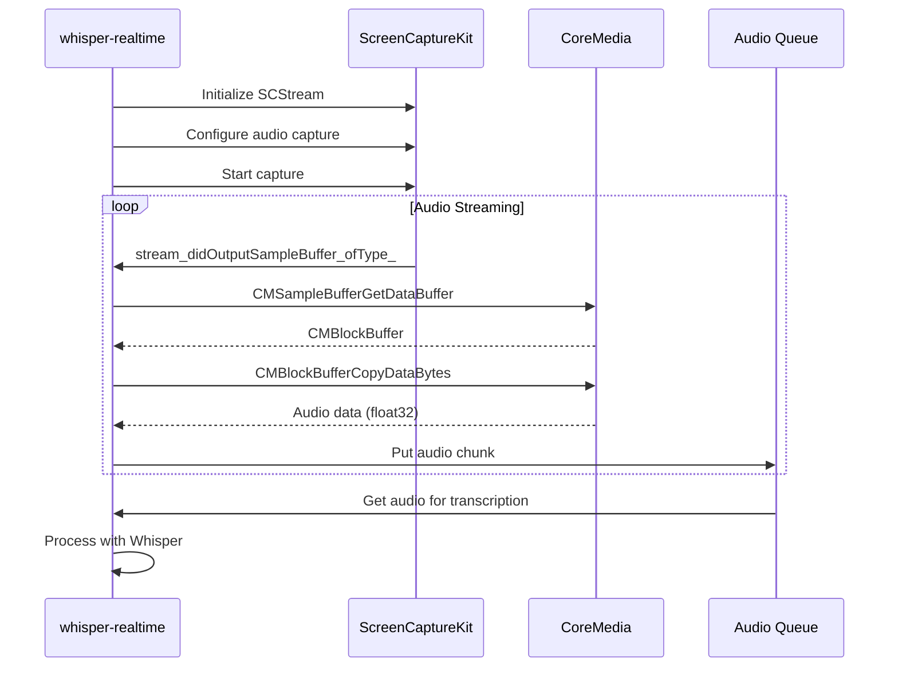
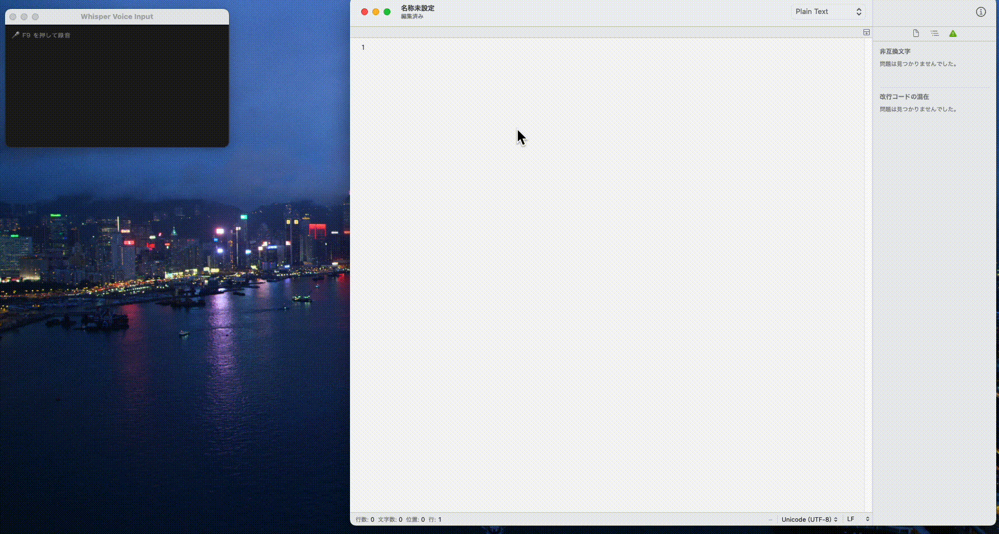
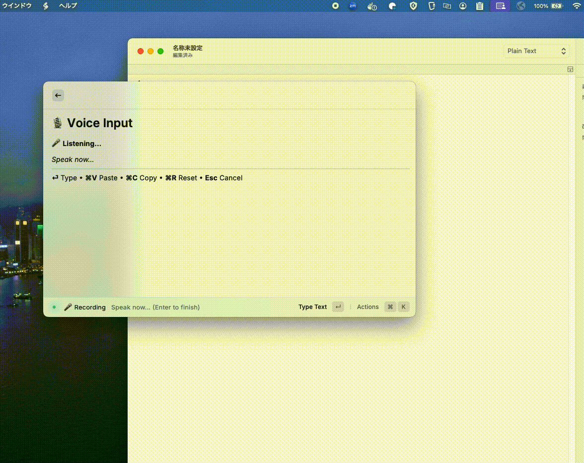
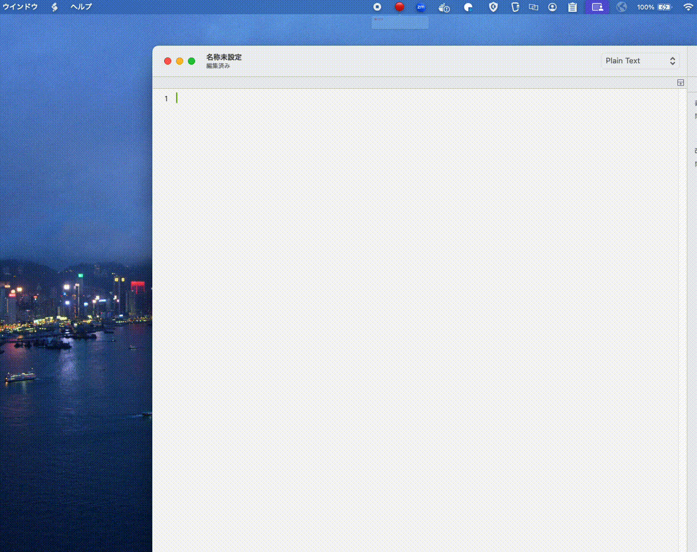
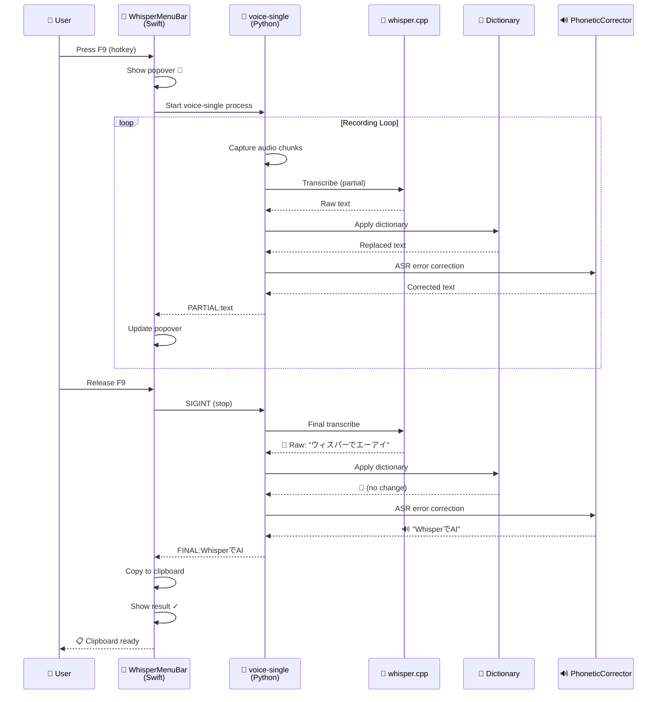
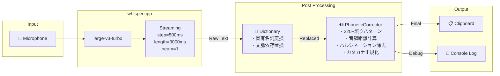

# whisper-realtime

A real-time speech transcription CLI tool using whisper.cpp, optimized for Apple Silicon (M1/M2/M3/M4) Macs.

## DEMO


## Features

- **Real-time transcription** with live text updates and corrections
- **Multiple audio input sources**:
  - Microphone input
  - System audio (via ScreenCaptureKit)
  - Both simultaneously
- **Speaker diarization** with color-coded labels
- **Stacked conversation display** - history at top, live transcription at bottom
- **Model selection** for speed vs accuracy trade-offs
- **Metal GPU acceleration** for Apple Silicon
- **Push-to-Talk voice input** - Hold a key to record, release to transcribe and copy to clipboard
- **Dictionary feature** - Context-aware word replacement for homophones
- **ASR Error Correction** - Phonetic-based automatic correction for speech recognition errors (220+ patterns)
- **GUI mode** - Floating window for visual feedback during voice input
- **Menu Bar App** - Native macOS menu bar app with popover UI (Swift)
- **Raycast Extension** - Native Raycast integration with real-time transcription display
- **Audio Recording** - Record audio while transcribing with `--record` option

## Architecture


```mermaid
graph TB
    subgraph Input Sources
        MIC[🎤 Microphone]
        SYS[🔊 System Audio]
    end

    subgraph Audio Capture Layer
        SD[sounddevice]
        SCK[ScreenCaptureKit<br/>macOS 13+]
        BH[BlackHole<br/>Fallback]
    end

    subgraph Processing Pipeline
        AC[AudioCapture]
        VAD[VAD Filter<br/>Voice Activity Detection]
        DIAR[Speaker Diarization]
        WE[WhisperEngine]
    end

    subgraph whisper.cpp
        MODEL[GGML Model]
        METAL[Metal GPU]
    end

    subgraph Output
        CLI[Rich CLI Display]
        FILE[File Output]
    end

    MIC --> SD
    SYS --> SCK
    SYS --> BH

    SD --> AC
    SCK --> AC
    BH --> AC

    AC --> VAD
    VAD --> DIAR
    DIAR --> WE

    WE --> MODEL
    MODEL --> METAL

    WE --> CLI
    WE --> FILE
```

## System Audio Capture Flow


```mermaid
sequenceDiagram
    participant App as whisper-realtime
    participant SCK as ScreenCaptureKit
    participant CM as CoreMedia
    participant Queue as Audio Queue

    App->>SCK: Initialize SCStream
    App->>SCK: Configure audio capture
    App->>SCK: Start capture

    loop Audio Streaming
        SCK->>App: stream_didOutputSampleBuffer_ofType_
        App->>CM: CMSampleBufferGetDataBuffer
        CM-->>App: CMBlockBuffer
        App->>CM: CMBlockBufferCopyDataBytes
        CM-->>App: Audio data (float32)
        App->>Queue: Put audio chunk
    end

    Queue->>App: Get audio for transcription
    App->>App: Process with Whisper
```

## Requirements

- macOS 13.0+ (Ventura or later) for ScreenCaptureKit
- Apple Silicon Mac (M1/M2/M3/M4)
- Python 3.10+
- [uv](https://docs.astral.sh/uv/) package manager
- Xcode Command Line Tools

## Installation

```bash
# Clone the repository
git clone https://github.com/tubone24/whisper-realtime
cd whisper-realtime

# Run setup script
./setup.sh
```

The setup script will:
1. Clone and build whisper.cpp with Metal acceleration
2. Download default models (tiny, base)
3. Install Python dependencies via uv

### Install macOS Extras (for System Audio)

For system audio capture without BlackHole:

```bash
uv pip install -e '.[macos]'
```

Then grant **Screen Recording** permission:
- Open **System Settings** → **Privacy & Security** → **Screen Recording**
- Enable permission for your terminal app (Terminal, iTerm2, etc.)

### Download Additional Models

```bash
# Download higher accuracy models
./setup.sh --skip-whisper --skip-python --model small
./setup.sh --skip-whisper --skip-python --model large-v3-turbo
```

## Usage

### Basic Commands

```bash
# Show help
uv run whisper-realtime --help

# Start transcription with microphone
uv run whisper-realtime start

# Capture system audio (YouTube, Zoom, etc.)
uv run whisper-realtime start -s system

# Capture both microphone and system audio
uv run whisper-realtime start -s both

# List audio devices
uv run whisper-realtime devices

# List available models
uv run whisper-realtime models
```

### Advanced Options

```bash
# Use specific model
uv run whisper-realtime start -m large-v3-turbo

# Use profile presets
uv run whisper-realtime start -p realtime  # Fastest
uv run whisper-realtime start -p balanced  # Balance
uv run whisper-realtime start -p quality   # High accuracy

# Specify language
uv run whisper-realtime start -l ja   # Japanese (default)
uv run whisper-realtime start -l en   # English
uv run whisper-realtime start -l auto # Auto-detect

# Enable speaker diarization
uv run whisper-realtime start --speaker

# Save output to file
uv run whisper-realtime start -o transcript.txt

# Record audio while transcribing
uv run whisper-realtime start --record recording.wav

# Record with speaker diarization and text output
uv run whisper-realtime start --speaker --record meeting.wav -o meeting.txt

# JSON output format (for external tools like Raycast)
uv run whisper-realtime start --output-format json --speaker

# Debug mode (show audio levels)
uv run whisper-realtime start --debug

# Adjust processing parameters
uv run whisper-realtime start --step 300 --length 3000
```

### Test Microphone

```bash
uv run whisper-realtime test-mic
```

### Push-to-Talk Voice Input

Push-to-Talk mode allows you to quickly transcribe voice input by holding a hotkey. The transcription result is automatically copied to your clipboard.

```bash
# Start Push-to-Talk voice input (default hotkey: Right Ctrl)
uv run whisper-realtime voice

# Use a different hotkey
uv run whisper-realtime voice --hotkey f5
uv run whisper-realtime voice --hotkey caps_lock

# With GUI mode (floating window)
uv run whisper-realtime voice --gui

# Specify model and language
uv run whisper-realtime voice -m base -l ja --gui
```

**Available hotkeys:**
- `ctrl_r`, `ctrl_l` - Right/Left Ctrl
- `alt_r`, `alt_l` - Right/Left Alt
- `shift_r`, `shift_l` - Right/Left Shift
- `f1` - `f12` - Function keys
- `caps_lock`, `scroll_lock`, `pause`

#### GUI Mode



When `--gui` is specified, a floating window appears showing:
- Recording status (idle/recording)
- Real-time transcription preview
- Confirmation when text is copied to clipboard

### Raycast Extension

A native [Raycast](https://raycast.com/) extension for real-time transcription with a beautiful UI.



#### Features

- Real-time transcription display with timestamps
- Speaker diarization with color-coded indicators (🔵 🟢 🟡 🟣 🔴 🟠)
- Copy transcription to clipboard with ⌘C
- Save transcription to file with ⌘⇧S
- Start/stop recording with ⌘R/⌘S

#### Installation

```bash
# Navigate to the Raycast extension directory
cd raycast-extension

# Install dependencies
npm install

# Start development mode
npm run dev
```

Then open Raycast, search for "Start Transcription" and configure the extension:

1. **whisper-realtime Path**: Set to this project's root directory (e.g., `/Users/your-name/whisper-realtime`)
2. **Model**: Select your preferred Whisper model (large-v3-turbo recommended)
3. **Language**: Choose transcription language
4. **Speaker Diarization**: Enable/disable speaker identification

#### Building for Distribution

```bash
cd raycast-extension
npm run build
```

#### Keyboard Shortcuts

| Shortcut | Action |
|----------|--------|
| ⌘R | Start Recording |
| ⌘S | Stop Recording |
| ⌘C | Copy to Clipboard |
| ⌘⇧S | Save to File |
| ⌘⌫ | Clear Transcription |

#### Display Format

The transcription is displayed with:
- **Timestamps**: `0:05` format showing when each segment was spoken
- **Speaker Icons**: 🔵 🟢 🟡 🟣 🔴 🟠 for different speakers
- **Partial/Final Indicators**: Partial transcriptions shown in italics with "(typing...)"

Example:
```
`0:00` 🔵 **話者0**: こんにちは
`0:02` 🟢 **話者1**: はい、こんにちは
`0:05` 🔵 **話者0**: *今日の議題は...* (typing...)
```

### Menu Bar App (macOS)

For a native macOS experience, you can use the **WhisperMenuBar** app. This provides:
- 🎤 Menu bar icon that stays in your status bar
- Native NSPopover UI that appears when recording
- F9 hotkey to start/stop recording (configurable in source)
- Automatic clipboard copy of transcription results



#### Menu Bar App Architecture


```mermaid
sequenceDiagram
    participant User as 👤 User
    participant Swift as 🍎 WhisperMenuBar<br/>(Swift)
    participant Python as 🐍 voice-single<br/>(Python)
    participant Whisper as 🎤 whisper.cpp
    participant Dict as 📖 Dictionary
    participant Phonetic as 🔊 PhoneticCorrector

    User->>Swift: Press F9 (hotkey)
    Swift->>Swift: Show popover 🔴
    Swift->>Python: Start voice-single process

    loop Recording Loop
        Python->>Python: Capture audio chunks
        Python->>Whisper: Transcribe (partial)
        Whisper-->>Python: Raw text
        Python->>Dict: Apply dictionary
        Dict-->>Python: Replaced text
        Python->>Phonetic: ASR error correction
        Phonetic-->>Python: Corrected text
        Python-->>Swift: PARTIAL:text
        Swift->>Swift: Update popover
    end

    User->>Swift: Release F9
    Swift->>Python: SIGINT (stop)

    Python->>Whisper: Final transcribe
    Whisper-->>Python: 🎤 Raw: "ウィスパーでエーアイ"
    Python->>Dict: Apply dictionary
    Dict-->>Python: 📖 (no change)
    Python->>Phonetic: ASR error correction
    Phonetic-->>Python: 🔊 "WhisperでAI"
    Python-->>Swift: FINAL:WhisperでAI

    Swift->>Swift: Copy to clipboard
    Swift->>Swift: Show result ✓
    Swift-->>User: 📋 Clipboard ready
```

#### Processing Pipeline Detail


```mermaid
flowchart LR
    subgraph Input
        MIC[🎤 Microphone]
    end

    subgraph "whisper.cpp"
        MODEL[large-v3-turbo]
        STREAM[Streaming<br/>step=500ms<br/>length=3000ms<br/>beam=1]
    end

    subgraph "Post Processing"
        DICT[📖 Dictionary<br/>・固有名詞変換<br/>・文脈依存置換]
        PHONETIC[🔊 PhoneticCorrector<br/>・220+誤りパターン<br/>・音韻距離計算<br/>・ハルシネーション除去<br/>・カタカナ正規化]
    end

    subgraph Output
        CLIP[📋 Clipboard]
        LOG[📝 Console Log]
    end

    MIC --> MODEL
    MODEL --> STREAM
    STREAM --> |Raw Text| DICT
    DICT --> |Replaced| PHONETIC
    PHONETIC --> |Final| CLIP
    PHONETIC --> |Debug| LOG
```

#### Building the Menu Bar App

```bash
# Navigate to the WhisperMenuBar directory
cd WhisperMenuBar

# Build the app (requires Xcode)
swift build

# Run the app
.build/debug/WhisperMenuBar
```

**Requirements:**
- Xcode (full installation, not just Command Line Tools)
- If using Command Line Tools, switch to Xcode:
  ```bash
  sudo xcode-select -s /Applications/Xcode.app
  ```

#### First Run Setup

1. **Accessibility Permission**: On first launch, you'll be prompted to grant accessibility permission. This is required for global hotkey detection.
   - Go to **System Settings** → **Privacy & Security** → **Accessibility**
   - Enable permission for `WhisperMenuBar`

2. **Microphone Permission**: When recording starts, you may be prompted to grant microphone access.

#### Usage

1. After launching, a 🎤 icon appears in your menu bar
2. Press **F9** to start recording (icon changes to 🔴)
3. Speak your message
4. Press **F9** again to stop recording
5. The transcription appears in a popover and is automatically copied to clipboard
6. After 2 seconds, the popover closes

#### Customization

Edit `WhisperMenuBar/Sources/main.swift` to customize:

```swift
// Change hotkey (in AppDelegate class)
private let hotkeyCode: CGKeyCode = 101  // F9 = 101, Right Ctrl = 62
private let hotkeyName = "F9"

// Change Whisper model
private let whisperModel = "base"  // tiny, base, small, large-v3-turbo

// Change language
private let whisperLanguage = "ja"  // ja, en, auto
```

After changes, rebuild with `swift build`.

#### Creating an App Bundle

To create a standalone `.app` bundle:

```bash
cd WhisperMenuBar
./bundle.sh
open build/WhisperMenuBar.app
```

### Dictionary Feature

The dictionary feature allows automatic replacement of words based on context. This is useful for:
- Replacing homophones (同音異義語) with the correct word
- Converting spoken terms to proper names (e.g., "ウィスパー" → "Whisper")
- Domain-specific term correction

```bash
# Show current dictionary
uv run whisper-realtime dictionary show

# Initialize with example dictionary
uv run whisper-realtime dictionary init

# Add a simple replacement rule
uv run whisper-realtime dictionary add "クロード" "Claude"

# Test dictionary on text
uv run whisper-realtime dictionary test "クロードでウィスパーを使う"
```

#### Dictionary Configuration

The dictionary is stored at `~/.config/whisper-realtime/dictionary.json`:

```json
{
  "simple": {
    "ウィスパー": "Whisper",
    "クロード": "Claude"
  },
  "replacements": [
    {
      "pattern": "エーアイ",
      "replacement": "AI",
      "is_regex": false
    }
  ],
  "context_rules": [
    {
      "pattern": "寝具",
      "replacement": "SING",
      "context_keywords": ["会社", "開発", "プロジェクト"],
      "negative_keywords": ["インテリア"],
      "window_size": 100
    }
  ]
}
```

**Context rules** check surrounding text (within `window_size` characters) for keywords before replacing. This helps distinguish homophones based on context.

### ASR Error Correction (Phonetic Corrector)

The phonetic corrector automatically fixes common speech recognition errors based on phonetic analysis. This is separate from the dictionary feature and handles:

- **Katakana term correction** - IT/tech terms (ウィスパー → Whisper, エーアイ → AI)
- **Homophone handling** - Words that sound the same but have different meanings
- **Hallucination removal** - Repeated phrases that Whisper sometimes generates
- **Number normalization** - Full-width to half-width conversion (１２３ → 123)

```bash
# Enable phonetic correction (default: enabled)
uv run whisper-realtime voice --phonetic

# Disable phonetic correction
uv run whisper-realtime voice --no-phonetic
```

#### Correction Examples

| Input (誤認識) | Output (訂正後) | Category |
|----------------|-----------------|----------|
| ウィスパー | Whisper | IT/Tech |
| エーアイ | AI | Abbreviation |
| パイソン | Python | Programming |
| ギットハブ | GitHub | Service |
| クーバネティス | Kubernetes | Infrastructure |
| 花竹 | 鼻茸 | Medical |
| 同じ文同じ文同じ文 | 同じ文 | Hallucination |

#### Phonetic Distance Calculation

The corrector uses weighted Levenshtein distance with phoneme confusion pairs:

```
Phoneme Confusion (low cost = easily confused):
- Voiced/Unvoiced: k↔g, t↔d, s↔z (cost: 0.3)
- Sibilants: s↔sh, z↔j, ch↔ts (cost: 0.3-0.4)
- Japanese-specific: r↔l (cost: 0.2, same in Japanese)
- Vowels: i↔e, u↔o (cost: 0.4)
- Long vowels: a↔aa, i↔ii (cost: 0.2)
```

#### Built-in Error Patterns (220+)

| Category | Count | Examples |
|----------|-------|----------|
| IT/Tech Terms | 87+ | Whisper, Claude, Python, Docker, AWS... |
| Business Terms | 30+ | 異動/移動, 規定/規程... |
| Medical Terms | 6 | 鼻茸, 鼻血, 肝癌... |
| Homophones | 50 groups | 機関/期間/器官, 科学/化学... |

#### Programmatic Usage

```python
from src.phonetic_corrector import PhoneticCorrector

corrector = PhoneticCorrector()

# Basic correction
result = corrector.correct("ウィスパーでエーアイの認識")
print(result.corrected_text)  # "WhisperでAIの認識"

# Hallucination detection
is_hallucination = corrector.detect_hallucination("ありがとうありがとうありがとう")
print(is_hallucination)  # {'has_hallucination': True, ...}

# Get homophone candidates
candidates = corrector.get_homophone_candidates("きかん")
print(candidates)  # ['機関', '期間', '器官', '気管', ...]

# Suggest corrections with phonetic similarity
suggestions = corrector.suggest_corrections("ウイスパ")
print(suggestions)  # [{'word': 'ウイスパ', 'suggestions': [('Whisper', 0.14)]}]
```

## Models

| Model | Size | Use Case |
|-------|------|----------|
| tiny | ~75MB | Fastest, real-time priority |
| base | ~142MB | Balanced (default) |
| small | ~466MB | Higher accuracy |
| medium | ~1.5GB | High accuracy |
| large-v3 | ~2.9GB | Maximum accuracy |
| large-v3-turbo | ~1.5GB | High accuracy + speed |

For real-time applications, `tiny` or `base` is recommended.

## CLI Options

### start command

| Option | Description |
|--------|-------------|
| `-s, --source` | Audio source: `mic`, `system`, `both` |
| `-m, --model` | Whisper model name |
| `-p, --profile` | Preset: `realtime`, `balanced`, `quality`, `best` |
| `-l, --language` | Language code (ja, en, auto) |
| `-d, --device` | Microphone device ID |
| `--system-device` | System audio device ID |
| `--speaker` | Enable speaker diarization |
| `--translate` | Translate to English |
| `-o, --output` | Output file path (text) |
| `-r, --record` | Record audio to WAV file |
| `-f, --output-format` | Output format: `rich`, `json`, `plain` |
| `--step` | Processing step (ms) |
| `--length` | Processing window length (ms) |
| `--vad/--no-vad` | Voice activity detection |
| `--debug` | Show debug information |

### voice command

| Option | Description |
|--------|-------------|
| `-m, --model` | Whisper model name (default: base) |
| `-l, --language` | Language code (default: ja) |
| `-d, --device` | Microphone device ID |
| `--hotkey` | Hotkey for Push-to-Talk (default: ctrl_r) |
| `--gui` | Show GUI window |
| `--vad-threshold` | VAD sensitivity 0-3 (default: 2) |
| `--no-vad` | Disable VAD filter |
| `--no-dictionary` | Disable dictionary replacement |
| `--phonetic/--no-phonetic` | Enable/disable ASR error correction (default: enabled) |

## System Audio Capture

### Method 1: ScreenCaptureKit (Recommended)

Available on macOS 13.0+ without any additional software:

```bash
# Install macOS dependencies
uv pip install -e '.[macos]'

# Grant Screen Recording permission in System Settings

# Use system audio
uv run whisper-realtime start -s system
```

**Requirements:**
- macOS 13.0 (Ventura) or later
- Screen Recording permission granted
- pyobjc-framework-ScreenCaptureKit installed

### Method 2: BlackHole (Fallback)

For older macOS versions or as fallback:

```bash
# Install BlackHole
brew install blackhole-2ch
```

After installation:
1. Open **Audio MIDI Setup** (search in Spotlight)
2. Click **+** at bottom left → **Create Multi-Output Device**
3. Check both your speakers and **BlackHole 2ch**
4. Set this multi-output device as system output in Sound settings

## Speaker Diarization

When `--speaker` is enabled:
- Up to 4 speakers are tracked
- Each speaker gets a unique color
- Speakers are identified by audio features (energy, zero-crossing rate)

```bash
uv run whisper-realtime start --speaker -s both
```

## Troubleshooting

### whisper.cpp build fails

Ensure Xcode Command Line Tools are installed:

```bash
xcode-select --install
```

### Model not found

Re-run model download:

```bash
./setup.sh --skip-whisper --skip-python
```

### ScreenCaptureKit not working

1. Ensure macOS 13.0+ is installed
2. Check Screen Recording permission:
   - System Settings → Privacy & Security → Screen Recording
   - Enable for your terminal app
3. Restart terminal after granting permission
4. Install macOS extras: `uv pip install -e '.[macos]'`

### No audio detected

1. Check microphone permission in System Settings
2. Run `uv run whisper-realtime test-mic` to verify
3. Check `uv run whisper-realtime devices` for correct device ID

### System audio not captured

1. For ScreenCaptureKit: Ensure Screen Recording permission is granted
2. For BlackHole: Verify multi-output device is set as system output
3. Make sure audio is actually playing in another app

## Dependencies

### Core
- sounddevice - Audio capture
- numpy - Audio processing
- rich - CLI display
- click - CLI framework
- pynput - Global hotkey detection for Push-to-Talk

### macOS (Optional)
- pyobjc-framework-ScreenCaptureKit - System audio capture
- pyobjc-framework-CoreMedia - Audio buffer handling

### Speaker Diarization (Optional)
- pyannote-audio - Advanced speaker diarization
- torch - PyTorch backend

## License

MIT License
