# whisper-realtime

A real-time speech transcription CLI tool using whisper.cpp, optimized for Apple Silicon (M1/M2/M3/M4) Macs.

## DEMO


## Features

- **Real-time transcription** with live text updates and corrections
- **Multiple audio input sources**:
  - Microphone input
  - System audio (via ScreenCaptureKit)
  - Both simultaneously
- **Speaker diarization** with color-coded labels
- **Stacked conversation display** - history at top, live transcription at bottom
- **Model selection** for speed vs accuracy trade-offs
- **Metal GPU acceleration** for Apple Silicon

## Architecture

```mermaid
graph TB
    subgraph Input Sources
        MIC[🎤 Microphone]
        SYS[🔊 System Audio]
    end

    subgraph Audio Capture Layer
        SD[sounddevice]
        SCK[ScreenCaptureKit<br/>macOS 13+]
        BH[BlackHole<br/>Fallback]
    end

    subgraph Processing Pipeline
        AC[AudioCapture]
        VAD[VAD Filter<br/>Voice Activity Detection]
        DIAR[Speaker Diarization]
        WE[WhisperEngine]
    end

    subgraph whisper.cpp
        MODEL[GGML Model]
        METAL[Metal GPU]
    end

    subgraph Output
        CLI[Rich CLI Display]
        FILE[File Output]
    end

    MIC --> SD
    SYS --> SCK
    SYS --> BH

    SD --> AC
    SCK --> AC
    BH --> AC

    AC --> VAD
    VAD --> DIAR
    DIAR --> WE

    WE --> MODEL
    MODEL --> METAL

    WE --> CLI
    WE --> FILE
```



## System Audio Capture Flow


## Requirements

- macOS 13.0+ (Ventura or later) for ScreenCaptureKit
- Apple Silicon Mac (M1/M2/M3/M4)
- Python 3.10+
- [uv](https://docs.astral.sh/uv/) package manager
- Xcode Command Line Tools

## Installation

```bash
# Clone the repository
git clone https://github.com/tubone24/whisper-cpp-test
cd whisper-cpp-test

# Run setup script
./setup.sh
```

The setup script will:
1. Clone and build whisper.cpp with Metal acceleration
2. Download default models (tiny, base)
3. Install Python dependencies via uv

### Install macOS Extras (for System Audio)

For system audio capture without BlackHole:

```bash
uv pip install -e '.[macos]'
```

Then grant **Screen Recording** permission:
- Open **System Settings** → **Privacy & Security** → **Screen Recording**
- Enable permission for your terminal app (Terminal, iTerm2, etc.)

### Download Additional Models

```bash
# Download higher accuracy models
./setup.sh --skip-whisper --skip-python --model small
./setup.sh --skip-whisper --skip-python --model large-v3-turbo
```

## Usage

### Basic Commands

```bash
# Show help
uv run whisper-realtime --help

# Start transcription with microphone
uv run whisper-realtime start

# Capture system audio (YouTube, Zoom, etc.)
uv run whisper-realtime start -s system

# Capture both microphone and system audio
uv run whisper-realtime start -s both

# List audio devices
uv run whisper-realtime devices

# List available models
uv run whisper-realtime models
```

### Advanced Options

```bash
# Use specific model
uv run whisper-realtime start -m large-v3-turbo

# Use profile presets
uv run whisper-realtime start -p realtime  # Fastest
uv run whisper-realtime start -p balanced  # Balance
uv run whisper-realtime start -p quality   # High accuracy

# Specify language
uv run whisper-realtime start -l ja   # Japanese (default)
uv run whisper-realtime start -l en   # English
uv run whisper-realtime start -l auto # Auto-detect

# Enable speaker diarization
uv run whisper-realtime start --speaker

# Save output to file
uv run whisper-realtime start -o transcript.txt

# Debug mode (show audio levels)
uv run whisper-realtime start --debug

# Adjust processing parameters
uv run whisper-realtime start --step 300 --length 3000
```

### Test Microphone

```bash
uv run whisper-realtime test-mic
```

## Models

| Model | Size | Use Case |
|-------|------|----------|
| tiny | ~75MB | Fastest, real-time priority |
| base | ~142MB | Balanced (default) |
| small | ~466MB | Higher accuracy |
| medium | ~1.5GB | High accuracy |
| large-v3 | ~2.9GB | Maximum accuracy |
| large-v3-turbo | ~1.5GB | High accuracy + speed |

For real-time applications, `tiny` or `base` is recommended.

## CLI Options

| Option | Description |
|--------|-------------|
| `-s, --source` | Audio source: `mic`, `system`, `both` |
| `-m, --model` | Whisper model name |
| `-p, --profile` | Preset: `realtime`, `balanced`, `quality`, `best` |
| `-l, --language` | Language code (ja, en, auto) |
| `-d, --device` | Microphone device ID |
| `--system-device` | System audio device ID |
| `--speaker` | Enable speaker diarization |
| `--translate` | Translate to English |
| `-o, --output` | Output file path |
| `--step` | Processing step (ms) |
| `--length` | Processing window length (ms) |
| `--vad/--no-vad` | Voice activity detection |
| `--debug` | Show debug information |

## System Audio Capture

### Method 1: ScreenCaptureKit (Recommended)

Available on macOS 13.0+ without any additional software:

```bash
# Install macOS dependencies
uv pip install -e '.[macos]'

# Grant Screen Recording permission in System Settings

# Use system audio
uv run whisper-realtime start -s system
```

**Requirements:**
- macOS 13.0 (Ventura) or later
- Screen Recording permission granted
- pyobjc-framework-ScreenCaptureKit installed

### Method 2: BlackHole (Fallback)

For older macOS versions or as fallback:

```bash
# Install BlackHole
brew install blackhole-2ch
```

After installation:
1. Open **Audio MIDI Setup** (search in Spotlight)
2. Click **+** at bottom left → **Create Multi-Output Device**
3. Check both your speakers and **BlackHole 2ch**
4. Set this multi-output device as system output in Sound settings

## Speaker Diarization

When `--speaker` is enabled:
- Up to 4 speakers are tracked
- Each speaker gets a unique color
- Speakers are identified by audio features (energy, zero-crossing rate)

```bash
uv run whisper-realtime start --speaker -s both
```

## Troubleshooting

### whisper.cpp build fails

Ensure Xcode Command Line Tools are installed:

```bash
xcode-select --install
```

### Model not found

Re-run model download:

```bash
./setup.sh --skip-whisper --skip-python
```

### ScreenCaptureKit not working

1. Ensure macOS 13.0+ is installed
2. Check Screen Recording permission:
   - System Settings → Privacy & Security → Screen Recording
   - Enable for your terminal app
3. Restart terminal after granting permission
4. Install macOS extras: `uv pip install -e '.[macos]'`

### No audio detected

1. Check microphone permission in System Settings
2. Run `uv run whisper-realtime test-mic` to verify
3. Check `uv run whisper-realtime devices` for correct device ID

### System audio not captured

1. For ScreenCaptureKit: Ensure Screen Recording permission is granted
2. For BlackHole: Verify multi-output device is set as system output
3. Make sure audio is actually playing in another app

## Dependencies

### Core
- sounddevice - Audio capture
- numpy - Audio processing
- rich - CLI display
- click - CLI framework

### macOS (Optional)
- pyobjc-framework-ScreenCaptureKit - System audio capture
- pyobjc-framework-CoreMedia - Audio buffer handling

### Speaker Diarization (Optional)
- pyannote-audio - Advanced speaker diarization
- torch - PyTorch backend

## License

MIT License
